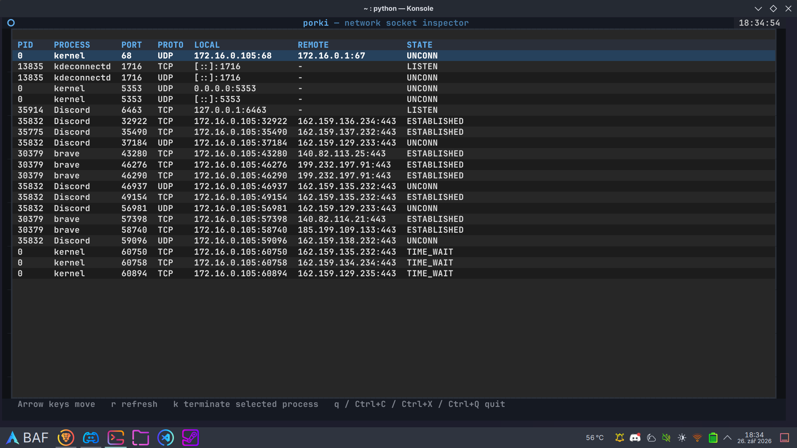

# PorKi

A small TUI application for inspecting active network sockets and terminating
the processes using them. The app is built with Python and the [Textual](https://textual.textualize.io/)
library.


## Installation
Install the application with the shell script:

```bash
curl -s https://raw.githubusercontent.com/kralicekgamer/porki/refs/heads/main/install.sh | sh
```

## Uninstall
```bash
curl -s https://raw.githubusercontent.com/kralicekgamer/porki/refs/heads/main/uninstall.sh | sh
```